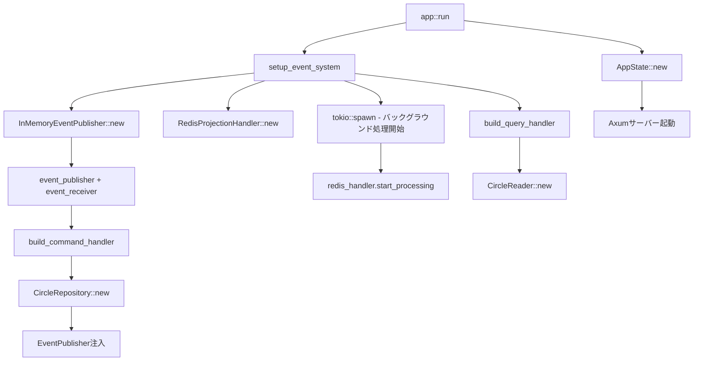
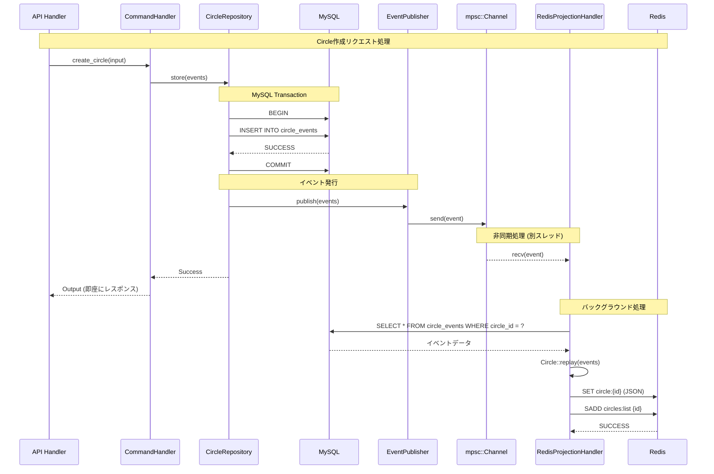
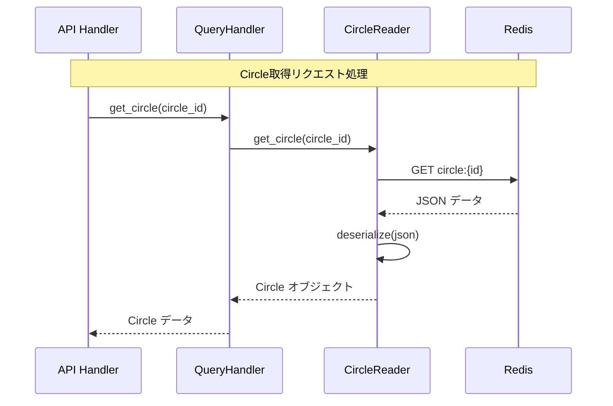
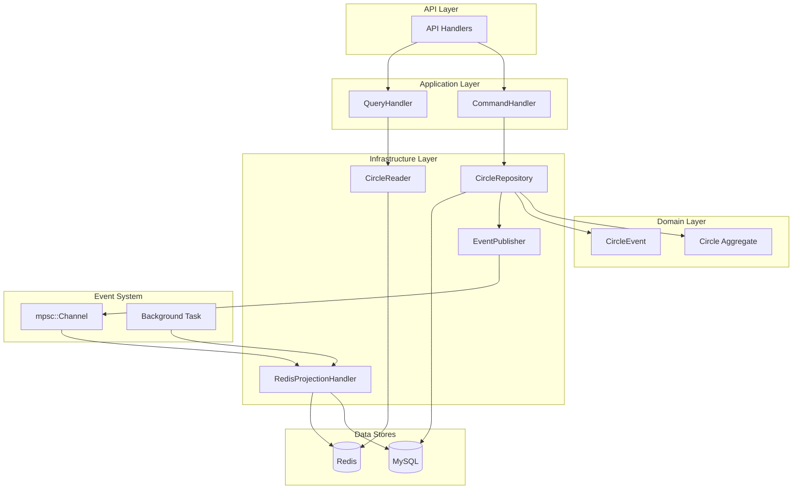
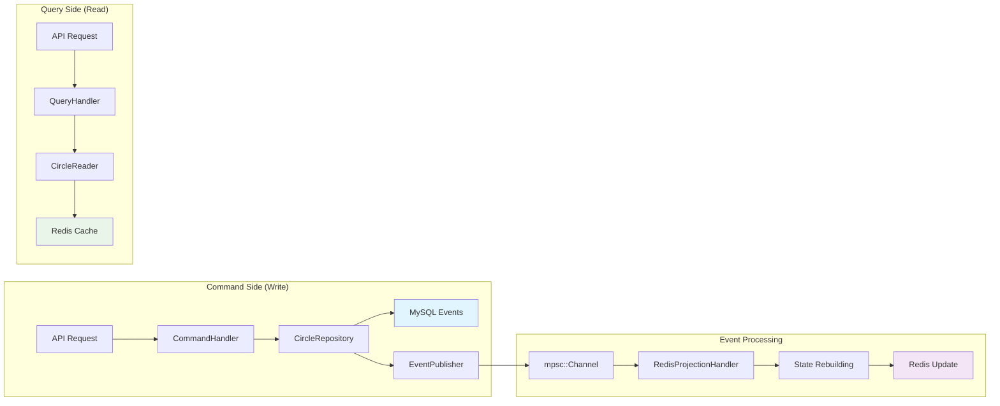
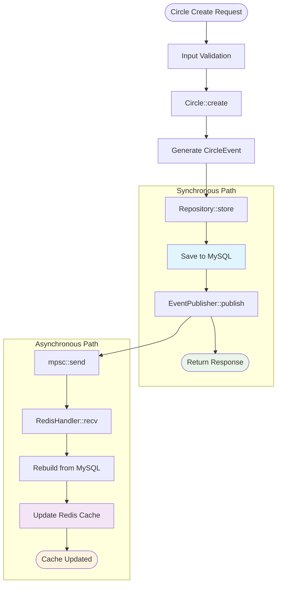
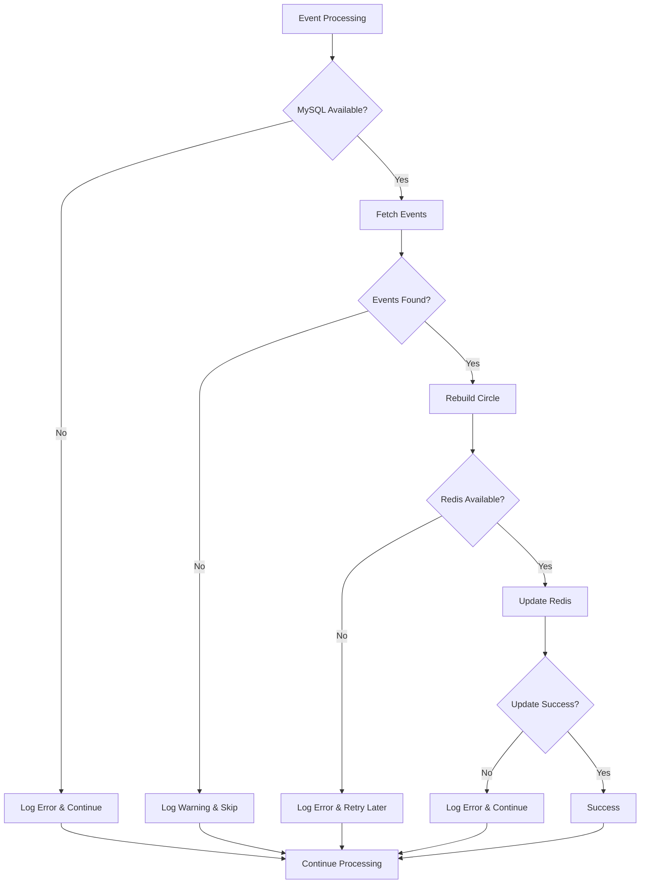
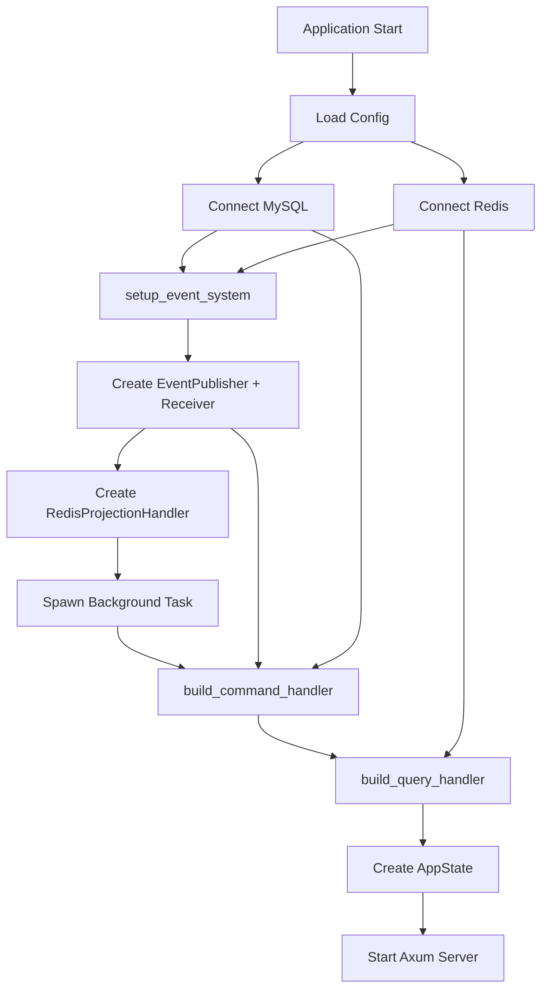

# イベントパブリッシュシステム - アーキテクチャ図

## システム初期化フロー

```mermaid
graph TD
    A[app::run] --> B[setup_event_system]
    B --> C[InMemoryEventPublisher::new]
    C --> D[event_publisher + event_receiver]
    B --> E[RedisProjectionHandler::new]
    B --> F[tokio::spawn - バックグラウンド処理開始]
    F --> G[redis_handler.start_processing]
    
    D --> H[build_command_handler]
    H --> I[CircleRepository::new]
    I --> J[EventPublisher注入]
    
    B --> K[build_query_handler]
    K --> L[CircleReader::new]
    
    A --> M[AppState::new]
    M --> N[Axumサーバー起動]
```

## コマンド実行シーケンス

```mermaid
sequenceDiagram
    participant API as API Handler
    participant CH as CommandHandler
    participant CR as CircleRepository
    participant DB as MySQL
    participant EP as EventPublisher
    participant Chan as mpsc::Channel
    participant RH as RedisProjectionHandler
    participant Redis as Redis

    Note over API, Redis: Circle作成リクエスト処理

    API->>CH: create_circle(input)
    CH->>CR: store(events)
    
    Note over CR, DB: MySQL Transaction
    CR->>DB: BEGIN
    CR->>DB: INSERT INTO circle_events
    DB-->>CR: SUCCESS
    CR->>DB: COMMIT
    
    Note over CR, EP: イベント発行
    CR->>EP: publish(events)
    EP->>Chan: send(event)
    
    Note over Chan, RH: 非同期処理 (別スレッド)
    Chan-->>RH: recv(event)
    
    CR-->>CH: Success
    CH-->>API: Output (即座にレスポンス)
    
    Note over RH, Redis: バックグラウンド処理
    RH->>DB: SELECT * FROM circle_events WHERE circle_id = ?
    DB-->>RH: イベントデータ
    RH->>RH: Circle::replay(events)
    RH->>Redis: SET circle:{id} (JSON)
    RH->>Redis: SADD circles:list {id}
    Redis-->>RH: SUCCESS
```

## クエリ実行シーケンス

```mermaid
sequenceDiagram
    participant API as API Handler
    participant QH as QueryHandler
    participant CR as CircleReader
    participant Redis as Redis
    
    Note over API, Redis: Circle取得リクエスト処理
    
    API->>QH: get_circle(circle_id)
    QH->>CR: get_circle(circle_id)
    CR->>Redis: GET circle:{id}
    Redis-->>CR: JSON データ
    CR->>CR: deserialize(json)
    CR-->>QH: Circle オブジェクト
    QH-->>API: Circle データ
```

## 全体アーキテクチャ

```mermaid
graph TB
    subgraph "API Layer"
        API[API Handlers]
    end
    
    subgraph "Application Layer"
        CH[CommandHandler]
        QH[QueryHandler]
    end
    
    subgraph "Domain Layer"
        Circle[Circle Aggregate]
        Events[CircleEvent]
    end
    
    subgraph "Infrastructure Layer"
        CR[CircleRepository]
        CReader[CircleReader]
        EP[EventPublisher]
        RH[RedisProjectionHandler]
    end
    
    subgraph "Data Stores"
        MySQL[(MySQL)]
        Redis[(Redis)]
    end
    
    subgraph "Event System"
        Chan[mpsc::Channel]
        BG[Background Task]
    end
    
    API --> CH
    API --> QH
    CH --> CR
    QH --> CReader
    CR --> Circle
    CR --> Events
    CR --> EP
    EP --> Chan
    Chan --> RH
    BG --> RH
    CR --> MySQL
    CReader --> Redis
    RH --> MySQL
    RH --> Redis
```

## コンポーネント責任図

```mermaid
graph LR
    subgraph "Command Side (Write)"
        A[API Request] --> B[CommandHandler]
        B --> C[CircleRepository]
        C --> D[MySQL Events]
        C --> E[EventPublisher]
    end
    
    subgraph "Event Processing"
        E --> F[mpsc::Channel]
        F --> G[RedisProjectionHandler]
        G --> H[State Rebuilding]
        H --> I[Redis Update]
    end
    
    subgraph "Query Side (Read)"
        J[API Request] --> K[QueryHandler]
        K --> L[CircleReader]
        L --> M[Redis Cache]
    end
    
    style D fill:#e1f5fe
    style I fill:#f3e5f5
    style M fill:#e8f5e8
```

## データフロー詳細

```mermaid
flowchart TD
    Start([Circle Create Request]) --> Validate[Input Validation]
    Validate --> Domain[Circle::create]
    Domain --> Events[Generate CircleEvent]
    Events --> Store[Repository::store]
    
    subgraph "Synchronous Path"
        Store --> MySQL[Save to MySQL]
        MySQL --> Publish[EventPublisher::publish]
        Publish --> Response([Return Response])
    end
    
    subgraph "Asynchronous Path"
        Publish --> Channel[mpsc::send]
        Channel --> Receive[RedisHandler::recv]
        Receive --> Rebuild[Rebuild from MySQL]
        Rebuild --> RedisUpdate[Update Redis Cache]
        RedisUpdate --> Done([Cache Updated])
    end
    
    style MySQL fill:#e1f5fe
    style RedisUpdate fill:#f3e5f5
    style Response fill:#e8f5e8
    style Done fill:#fff3e0
```

## エラーハンドリングフロー

```mermaid
graph TD
    A[Event Processing] --> B{MySQL Available?}
    B -->|No| C[Log Error & Continue]
    B -->|Yes| D[Fetch Events]
    D --> E{Events Found?}
    E -->|No| F[Log Warning & Skip]
    E -->|Yes| G[Rebuild Circle]
    G --> H{Redis Available?}
    H -->|No| I[Log Error & Retry Later]
    H -->|Yes| J[Update Redis]
    J --> K{Update Success?}
    K -->|No| L[Log Error & Continue]
    K -->|Yes| M[Success]
    
    C --> N[Continue Processing]
    F --> N
    I --> N
    L --> N
    M --> N
```

## 設定・初期化フロー

```mermaid
graph TD
    A[Application Start] --> B[Load Config]
    B --> C[Connect MySQL]
    B --> D[Connect Redis]
    C --> E[setup_event_system]
    D --> E
    E --> F[Create EventPublisher + Receiver]
    F --> G[Create RedisProjectionHandler]
    G --> H[Spawn Background Task]
    H --> I[build_command_handler]
    F --> I
    C --> I
    I --> J[build_query_handler]
    D --> J
    J --> K[Create AppState]
    K --> L[Start Axum Server]
```