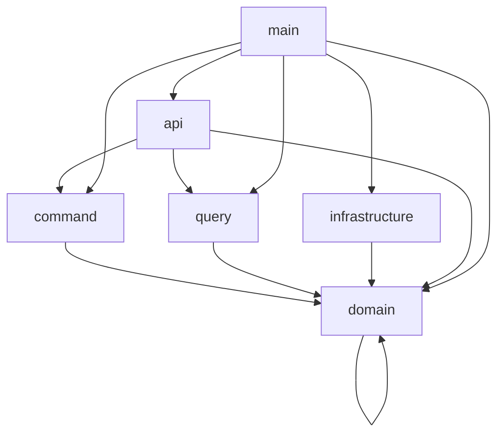

## Project Structure

### Crate Dependencies

The diagram shows the dependency relationships between the crates:
- **domain**: Core business logic and interfaces
- **command**: Command handling functionality
- **query**: Query handling functionality
- **infrastructure**: Concrete implementations of domain interfaces
- **api**: HTTP endpoints exposing the application
- **main**: Entry point that wires everything together

